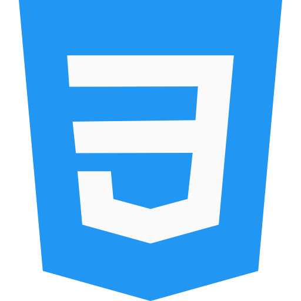
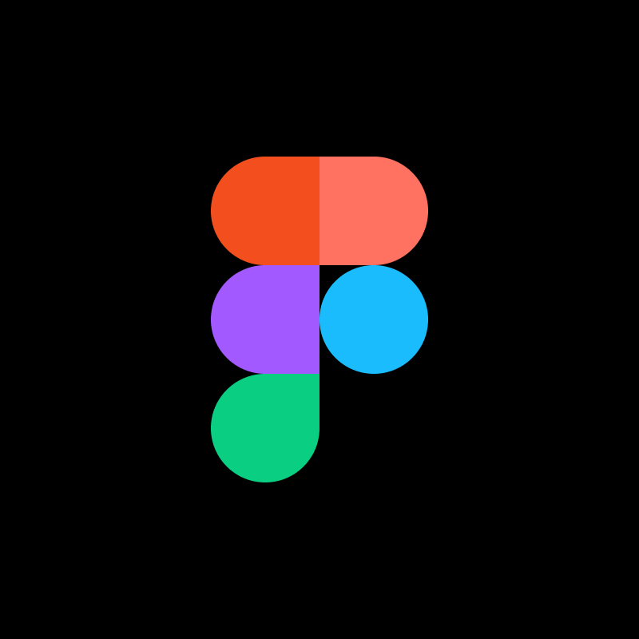

<h1 align="center">Hi I'm Manikandan</h1>
<h3 align="center">Engineering-Student | Web Developer | Freelancer </h3> 

PS : This page was designed to look good on dark mode, try it! Oh, and don't mind the creepy stare of myavatar on the left ;)

I'm a newbie coder who is interested in a lot of things related to programming and who's got a lot of fingers in a lot of different pies. I would say that my end-goal is to be a data science specialist but at the moment I'm a web developer as well as freelancer.

 

# Talking about Personal Stuffs...

- 🔭 I'm Currently Learning **React JS & DSA**
- 😉 I'm Looking to clollaborate on **Web Development**
- 🦄 I'm Looking for Collaborate with any **Open - Source Contribution**
- 🤔 I’m Looking for with **Internships**
- 🔨 I’m currently working on my project portfolio
- 💬 Ask me about Anything [here](https://github.com/smir45/smir45/issues)! I am happy to help.
- 😄 Pronouns : **He/Him/His**  

   

 

<h1>💻 Things I know</h1>

<i>Tools, languages, and other things that I like to work with.</i>   

<table >
  <tr>
    <td align="center" width="96" style="border:1px solid #3A424A">
      
       HTML
    </td>
    <td align="center" width="96" style="border:1px solid #3A424A">
      
       CSS
    </td>
    <td align="center" width="96" style="border:1px solid #3A424A">
      
       Javascript
    </td>
    <td align="center" width="96" style="border:1px solid #3A424A">
      
       React
    </td>
     <td align="center" width="96" style="border:1px solid #3A424A">
      
       SASS
    </td>
    <td align="center" width="96" style="border:1px solid #3A424A">
      
       Bootstrap
    </td>
    <td align="center" width="96" style="border:1px solid #3A424A">
      
       Python
    </td>
        <td align="center" width="96" style="border:1px solid #3A424A">
      
       Figma
    </td>
    <td align="center" width="96" style="border:1px solid #3A424A">
      
       Photoshop
    </td>
  </tr>
</table>
 
