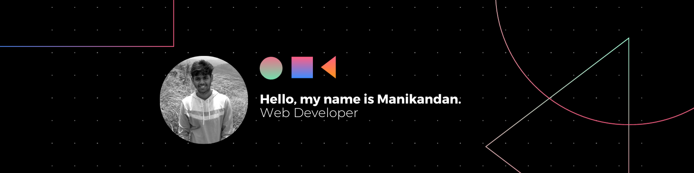

# Hello, I'm Manikandan 👋

## 🚀 Objective
I am a passionate React.js developer who is pursuing my engineering degree simultaneously working hard to improve my skills in an ever-changing area. My interests encompass the MERN stack, and I am dedicated to expanding my knowledge by staying up to date on industry innovations. If you are looking for an intern or open-source partnership, I would love to connect and discuss potential synergies. Here's a bit about me:

## 🖥️ About me
- 🔭 Skilled with the **MERN stack** and enthusiastic about web apps.
- 🌱 I'm always eager to learn and stay up-to-date with the latest industry trends.
- 🚀 As a web developer, I thrive on new challenges and strive to make important contributions to projects.
- ⏰ Master of Time Management: Punctuality and quality work are my trademarks.

## 🚀 Skills

<table>
    <tr>
        <td align="center" style="border:1px solid #3A424A">
            
             HTML
        </td>
        <td align="center" style="border:1px solid #3A424A">
            
             CSS
        </td>
        <td align="center" style="border:1px solid #3A424A">
            
             SASS
        </td>
        <td align="center" style="border:1px solid #3A424A">
            
             Bootstrap
        </td>
    </tr>
    <tr>
        <td align="center" style="border:1px solid #3A424A">
            
             JavaScript
        </td>
        <td align="center" style="border:1px solid #3A424A">
            
             React.js
        </td>
        <td align="center" style="border:1px solid #3A424A">
            
             Node.js
        </td>
        <td align="center" style="border:1px solid #3A424A">
            
             Firebase
        </td>
    </tr>
    <tr>
        <td align="center" style="border:1px solid #3A424A">
            
             MySQL
        </td>
        <td align="center" style="border:1px solid #3A424A">
            
             Figma
        </td>
        <td align="center" style="border:1px solid #3A424A">
            
             Canva
        </td>
    </tr>
</table>
 

## 💼 Work Experience
- Developer Intern at Xanadu Pvt Ltd, Bangalore 🖥️
- Freelancer on Fiverr, specializing in website development 💼🌐
  
## 🧬 Background
- React Developer 👨‍💻
- Bachelor's Degree in Computer Engineering 🎓
- Proud Indian 🇮🇳

## 📈 Github stats

## Connect with me:

 

 

 
<b>Visitors Count</b>
  

 
 
